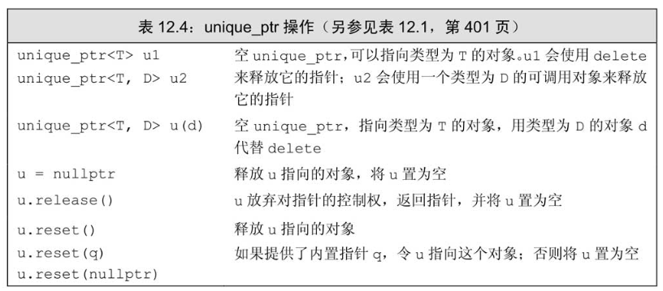
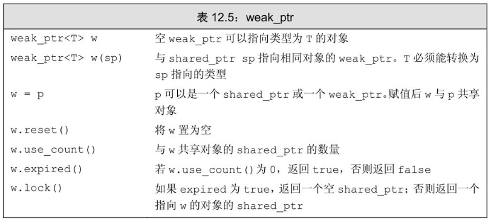
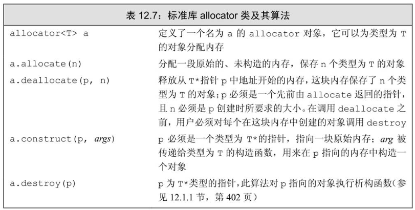

# 动态内存

---

## shared_ptr

### 初始化

```cpp
shared_ptr<string> p1;
shared_ptr<list<int>> p2;
shared_ptr<int> p3 = make_shared<int>(42);
shared_ptr<string> p4 = make_shared<string>(10, '9');
shared_ptr<int> p5 = make_shared<int>(); //值初始化（构造）为0
```

### 拷贝赋值

```cpp
auto p = make_shared<int>(42);
auto q(p); //计数器++
auto r = make_shared<int>(43);
r = p; //r原先指向的内存被释放
```

### 自动销毁

当指向**动态内存**的最后一个**shared_ptr**被**销毁**时，shared_ptr会调用**析构函数**来释放动态内存；

#### 函数返回智能指针

- p1离开作用域时，factory返回的动态内存也被销毁

    ```cpp
    template <typename T> shared_ptr<int> factory(T arg)
    {
        return make_shared<int>(arg);
    }

    void t_use_shared_ptr()
    {
        shared_ptr<int> p1 = factory(1);
    }
    ```

## New

使用new直接在堆区创建对象;

### 初始化

```cpp
int *p = new int;
string *ps = new string("123");
string *ps = new string(10,'0');
vector<int> *pv = new vector<int>{0, 1, 2, 3, 4, 5};
```

- 不要让一个原始指针初始化多次智能指针：会出现多个智能指针独立管理相同内存问题（以及double free问题）

    ```cpp
    int *ptr = new int(42);
    shared_ptr<int> p1(ptr, [](int *p) { delete p; });
    shared_ptr<int> p2(ptr, [](int *p) { delete p; });
    cout << "p1 use count: " << p1.use_count() << endl; // 输出引用计数
    cout << "p2 use count: " << p2.use_count() << endl;
    ```

  - 正确做法：

    ```cpp
    // 正确：只有一个shared_ptr管理内存
    shared_ptr<int> p1 = make_shared<int>(42);
    shared_ptr<int> p2(p1);  // 安全的拷贝
    ```

### 分配const对象

```cpp
const int *pci = new const int(1);
cosnt string *pcs = new const string; //分配并默认初始化一个空的string
```

### 内存耗尽

```cpp
int *p1 = new int; //分配失败抛出bad_alloc异常
int *p2 = new (nothrow) int; //分配失败返回空指针
```

### 内存释放

- 释放指向动态内存的指针
- 可以释放空指针
- 不能重复释放

```cpp
//const 对象不能修改，但是可以释放
const int *pci = new const int(1024);
delete pic;
pci = nullptr;
```

## shared_ptr和new结合使用

### 使用new初始化shared_ptr

```cpp
shared_ptr<double> p1;
shared_ptr<int> p2(new int(42));
```

- 不可以隐式类型转换来构造一个`shared_ptr<T>`指针

    ```cpp
    //错误，隐式类型转换
    shared_ptr<int> p1 = new int(42);

    shared_ptr<int> clone(int p) {
        //return new int(p); //错误
        return shared_ptr<int>(new int(p));
    }
    ```

- `shared_ptr<T>`作为参数

    ```cpp
    shared_ptr<int> p(new int(42));
    process(p);
    int i = *p; //正确
    ```

  - 错误场景

    ```cpp
    int *x(new int(1024));
    process(x); //错误，隐式类型转换
    process(shared_ptr<int>(x)); //正确
    int j = *x;//错误，此时已经被释放
    ```

- 两个指针指向相同的动态内存：

    ```cpp
    shared_ptr<int> p(new int(42));
    int *q = p.get(); //q指向动态内存
    {
        shared_ptr<int> x(q);
    } //离开q作用域，q被销毁，动态内存被释放
    int foo = *p;
    ```

### 其它操作

- 指向新的对象

```cpp
p = new int(1024);
p.reset(new int(1024)); //引用计数为0，则释放

if (!p.unique())
    p.reset(new string(*p)); //不是唯一用户，分配并拷贝
*p += newVal;
```

- 异常抛出和动态内存释放问题

  - 共享指针可以自动释放

    ```cpp
    void f() {
        shared_ptr<int> sp(new int(42));
        //抛出异常
    } //函数结束时，自动释放
    ```

  - 普通指针只能手动释放

    ```cpp
    void f()
    {
        int *ip = new int(42);
        //抛出异常
        delete ip;
    } //如果没有捕获异常处理，不会自动释放
    ```

## unique_ptr



### 初始化

```cpp
unique_ptr<int> p1;
unique_ptr<int> p2(new int(42));
```

- unique_ptr不支持拷贝和赋值：

    ```cpp
    unique_ptr<int> p1(new int(42));

    unique_ptr<int> p2(p1); //错误，不支持拷贝
    unique_ptr<int> p3 = p1;  //错误，不支持赋值
    ```

### 转移所有权

- 使用release和reset转移

    ```cpp
    unique_ptr<int> p1(new int(52));
    unique_ptr<int> p2(p1.release()); //接管p1指向的动态内存

    unique_ptr<int> p3(new int(42)); 
    p2.reset(p3.release()); //p2原来的被释放，p2接管p3
    ```

### 拷贝例外场景

- 编译器知道要返回的对象即将销毁，在这种场景下执行一种特殊的拷贝：

    ```cpp
    unique_ptr<int> clone(int i) {
        unique_ptr<int> ret(new int(i));
        return ret;
    }

    unique_ptr<int> clone1(int i) {
        return unique_ptr<int>(new int(i));
    }
    ```

### 传递删除器

```cpp
unique_ptr<objT, delT> p(new objT, fcn);
```

## weak_ptr

**weak_ptr**指向一个**shared_ptr**管理的对象，不增加引用计数，一旦指向对象的最后一个sharedptr被销毁，对象会被释放（**即便有weak_ptr指向对象**）



### 初始化

```cpp
auto p = make_shared<int>(42);
weak_ptr<int> wp(p); //弱共享，不会改变引用计数
```

### lock

使用`weak_ptr.lock()`来返回一个指向被管理动态内存的`shared_ptr`，引用计数会+1

```cpp
if(shared_ptr<int> np = wp.lock()) {
    ···
}
```

## 动态数组

**应使用容器，而不是动态分配数组!!!**

### 初始化

动态分配数组，返回的是指针而不是对象，因此不能使用begin()或者end()，也不能使用范围for语句来处理数组中的元素

```cpp
int *pia = new int(get_size());

typedef int arrT[42];
int *p = new arrT;
```

- 默认初始化和值初始化

    ```cpp
    //内置类型
    int *pia = new int[10]; //默认初始化，实际上就是不初始化
    int *pia = new int[10](); //值初始化为0

    //对象类型
    string *pis = new string[10]; //默认初始化，调用默认构造函数，初始化为空字符串
    string *pis = new string[10](); //默认初始化，调用默认构造函数，初始化为空字符串
    ```

- 创建空的动态数组

    ```cpp
    char arr[0];
    char *cp = new char[0]; //正确，但是cp不能解引用
    ```

### 销毁动态数组

- 使用delete

```cpp
int *pia = new int[10];
delete [] pia;
```

- 使用unique_ptr自动销毁

```cpp
unique_ptr<int[]> p(new int[10]);
unique_ptr<int[]> up(new int[10]);
up.reset(p);
```

### 只能指针与动态数组

- unique_ptr可以直接管理动态数组

```cpp
unique_ptr<int[]> p(new int[10])
p[3] = 3;
```

- shared_ptr不可以直接管理动态数组

```cpp
shared_ptr<int[]> p(new int[10])
for (int i = 10; i< 10; i++)
    *(p.get() + i) = 10;
```

## allocator类


